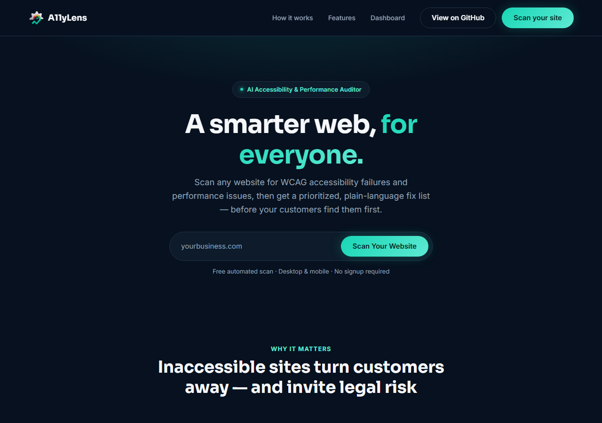
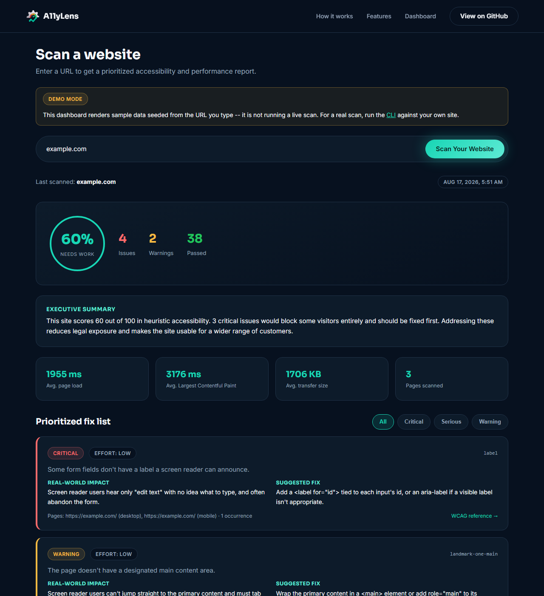

# A11yLens

AI Accessibility and Performance Auditor for Small Business Websites.

Give it a URL. It crawls the site, runs automated WCAG accessibility and
performance checks on desktop and mobile, hands the raw violations to
Gemini, and outputs a prioritized, plain-language fix-it report as HTML
(and optionally PDF) — the kind of report a non-technical business owner
can actually read and act on.

<p>
  
  
</p>

The dashboard screenshot above is from a real scan — the dashboard runs the
same crawl/axe-core/Gemini pipeline as the CLI (see
[Running the dashboard](#running-the-dashboard)).

## The problem this solves

Most small business websites fail basic accessibility checks — missing
alt text, low-contrast text, unlabeled form fields, keyboard traps — not
out of neglect, but because nobody on the team knows WCAG exists. Two
consequences follow:

1. **Excluded customers.** Roughly 1 in 4 adults in the US lives with a
   disability. A site that a screen reader can't parse, or that can't be
   operated without a mouse, silently turns those visitors away.
2. **Legal exposure.** Title III of the ADA has been applied to websites
   by U.S. courts for over a decade, and demand letters/lawsuits over
   inaccessible websites are increasingly common — disproportionately
   targeting small and mid-sized businesses that never budgeted for a
   professional accessibility audit (which typically costs thousands of
   dollars from a specialist firm).

A11yLens doesn't replace a certified manual audit (no automated tool can
— axe-core's own documentation estimates automated checks catch roughly
30-40% of WCAG issues). What it does is give a business owner or small
dev team a fast, free, prioritized starting point: what's broken, why it
matters to a real user, and what to fix first.

## How it works

```
URL
 │
 ▼
Playwright headless browser ──► crawls same-origin pages (BFS, capped)
 │
 ▼
axe-core injected into each page, run at desktop (1440×900) and
mobile (390×844) viewports ──► raw WCAG violations + Navigation/Resource
                                Timing performance data
 │
 ▼
Violations deduplicated by rule, ranked by impact severity
 │
 ▼
Gemini (gemini-flash-latest) ──► plain-language explanation, real-world impact,
                               concrete fix, priority, and effort estimate
                               per issue + an executive summary
 │
 ▼
Styled HTML report (and optional PDF via Playwright's print-to-PDF)
```

### Why Playwright

Real accessibility bugs live in the rendered DOM after JavaScript runs —
static HTML fetches miss client-rendered content, dynamically injected
ARIA attributes, and viewport-dependent layout issues (e.g. a hamburger
menu that's keyboard-inaccessible only on mobile). Playwright drives an
actual Chromium instance, so the audit sees what a real visitor's browser
sees, at both desktop and mobile viewport sizes. It's also used to
generate the PDF report (print-to-PDF against the rendered HTML report),
so there's no second PDF library dependency.

### Why axe-core

axe-core (from Deque Systems) is the free, open-source, industry-standard
accessibility rules engine — the same engine behind Chrome DevTools'
Lighthouse accessibility audit. It's run directly inside the page context
via `page.evaluate()`, tests against WCAG 2.0/2.1 A and AA success
criteria plus best-practice rules, and returns structured violation data
(rule id, severity/impact, affected DOM nodes, and a help URL) with zero
false-positive tolerance by design — axe only reports what it can prove.

### Why an LLM on top

axe-core's raw output is written for developers: rule IDs, CSS selectors,
WCAG success-criterion codes. A small business owner can't act on
`color-contrast: 4.2:1 ratio required 4.5:1`. The LLM step translates
each violation into plain language, explains who it actually affects and
how, gives a concrete fix, and prioritizes the whole list by severity and
effort — turning a compliance report into a to-do list.

## Setup

```bash
npm install          # also installs the Playwright Chromium browser
cp .env.example .env # add your GEMINI_API_KEY
```

Get a free API key at https://aistudio.google.com/apikey (no credit card
required). Without a key set, the tool still runs and produces a full
report — it just falls back to raw axe-core rule text instead of
AI-generated explanations.

## Usage

```bash
node src/index.js https://example.com
node src/index.js example.com --max-pages 8 --pdf
node src/index.js example.com --out ./my-reports
```

| Flag          | Default   | Description                                   |
| ------------- | --------- | ---------------------------------------------- |
| `--max-pages` | `5`       | Max same-origin pages to crawl and scan        |
| `--out`       | `reports` | Output directory                                |
| `--pdf`       | off       | Also render a PDF alongside the HTML report     |

Output: `reports/<hostname>-report.html` (and `.pdf` with `--pdf`).

## Running the dashboard

```bash
npm run dev:ui
```

Open http://localhost:3000, type a URL, and click "Scan Your Website." This
runs a real scan through `scripts/serve.mjs`'s `POST /api/scan` endpoint —
the exact same crawl/axe-core/Gemini pipeline the CLI uses (`src/pipeline.js`)
— and renders the results in the browser instead of writing an HTML file.

## Deploying the dashboard

A real scan needs a real headless browser. There are two working paths:

### Option A — a regular Node host (simplest, most reliable)

Render, Railway, Fly.io, a VPS. Point the start command at `npm run dev:ui`
(= `node scripts/serve.mjs`), set `GEMINI_API_KEY` in the host's
environment, and let it use the `$PORT` the host assigns — the server
already reads `process.env.PORT`. This uses the full `playwright` package
and is the same code path as local development, so it's the least likely
to surprise you.

### Option B — Vercel, as a serverless function

`api/scan.js` implements the same endpoint as a Vercel Node.js Serverless
Function, using `playwright-core` + [`@sparticuz/chromium`](https://github.com/Sparticuz/chromium)
(a Chromium build sized for serverless deployment) instead of the full
`playwright` package, which doesn't fit. To make this work:

1. In the Vercel project's settings, set **Root Directory** back to the
   repository root (blank/default) — not `public`. The function needs
   access to `src/` outside that folder; `vercel.json`'s
   `"outputDirectory": "public"` handles serving the static site correctly
   once Root Directory is reset.
2. Add `GEMINI_API_KEY` as a Vercel **Environment Variable** (Project
   Settings → Environment Variables) — it isn't read from `.env`, which
   isn't part of the deployment.
3. `vercel.json` requests `maxDuration: 60` for `api/scan.js`. Vercel's
   Hobby (free) tier caps function duration well below what a real crawl +
   axe-core scan + Gemini call needs — this realistically requires a
   **Pro plan** (or Fluid Compute) to work reliably.
4. Redeploy after making the above changes.

**Known risk:** `playwright-core` and `@sparticuz/chromium` must be
version-matched to the same underlying Chromium build to work reliably
together, and this combination could not be fully tested outside an actual
Vercel deployment (different OS/architecture than local development). If
scans fail on Vercel with a 500, check that deployment's function logs
first — the fix is very likely a version adjustment in `package.json`, not
a logic bug.

### Static-only (no scan feature)

`public/index.html` alone is safe on any static host with no setup. Its
"Scan your site" button will still lead to the dashboard, whose scan
requests will fail with a clear error message unless one of the two
options above is deployed alongside it.

## Testing

```bash
npm test
```

Runs the characterization tests in `test/` via Node's built-in test runner.
They cover the pure aggregation/scoring/report-rendering logic, the
crawler's BFS/dedup/origin rules (against a fake in-memory page, not a real
browser), and the CLI's argument validation -- no network or browser
required.

## What gets checked

- **Accessibility** (axe-core, WCAG 2.0/2.1 A + AA + best practices):
  missing alt text, insufficient color contrast, unlabeled form inputs,
  missing/invalid ARIA, keyboard-trap risks, heading structure, and more.
- **Performance**: page load timing, Largest Contentful Paint, and total
  transfer size, all captured per page via the browser's Navigation and
  Resource Timing APIs — no third-party performance API required.

Each scanned page is checked at both a desktop and a mobile viewport,
since layout- and touch-target-related issues frequently only appear at
one size.

## Project structure

```
src/
  crawler.js         same-origin BFS page discovery
  scanner.js         axe-core + performance data collection, aggregation, scoring
  llm.js             Gemini prompt/response handling for the plain-language report
  validate.js         shared URL validation (CLI args and API requests)
  pipeline.js         shared crawl -> scan -> explain orchestration (runAudit)
  report.js          styled HTML report renderer (CLI only)
  index.js           CLI entry point: args, calls pipeline.js, writes HTML/PDF
test/                characterization tests for the above (node --test)
public/              static marketing landing page + live dashboard UI
  index.html         landing page
  dashboard.html     scan UI -- calls POST /api/scan for a real scan
  privacy.html, terms.html   legal pages
  assets/            shared styles.css, app.js (nav), dashboard.js (fetch + render), logo/favicon
scripts/serve.mjs    static file server for public/ + POST /api/scan (npm run dev:ui)
api/scan.js          POST /api/scan as a Vercel serverless function (playwright-core + @sparticuz/chromium)
vercel.json          Vercel config: serve public/ as static output, maxDuration for api/scan.js
```

## Current state

| Piece | Status |
|---|---|
| CLI (`src/`) | Real. Runs an actual crawl, axe-core scan, and Gemini call against whatever URL you give it. |
| Landing page (`public/index.html`) | Real, static marketing page. |
| Dashboard (`public/dashboard.html`) | Real. Runs a genuine scan through `POST /api/scan`, backed by either `scripts/serve.mjs` (any Node host) or `api/scan.js` (Vercel serverless function) — both call the same `src/pipeline.js` pipeline the CLI uses. |

The dashboard needs one of those two backends actually running to do
anything. Opened as a bare `file://` page, or deployed as a static-only
site with neither backend configured, the scan request has nothing to talk
to and the UI reports that clearly instead of hanging. See
[Deploying the dashboard](#deploying-the-dashboard) below for both options.

## Limitations

- Automated scanning is a starting point, not a compliance guarantee —
  pair it with manual keyboard/screen-reader testing before claiming
  WCAG conformance.
- The crawler only follows same-origin `<a href>` links reachable without
  authentication; it won't discover pages behind logins or JS-only
  routing that doesn't update visible links.
- Point it at sites you trust enough to open in your own browser. Only
  same-origin pages are ever scanned or included in the report, but a
  target that redirects off-origin still causes one request to that
  destination before the crawler drops the page — the same thing that
  happens if you click the link yourself. That request comes from your
  machine, so avoid scanning untrusted sites from inside a network where
  a stray GET to an internal address would matter.
- The 0–100 score is a heuristic weighted by axe impact severity, not a
  certified metric from any standards body.
